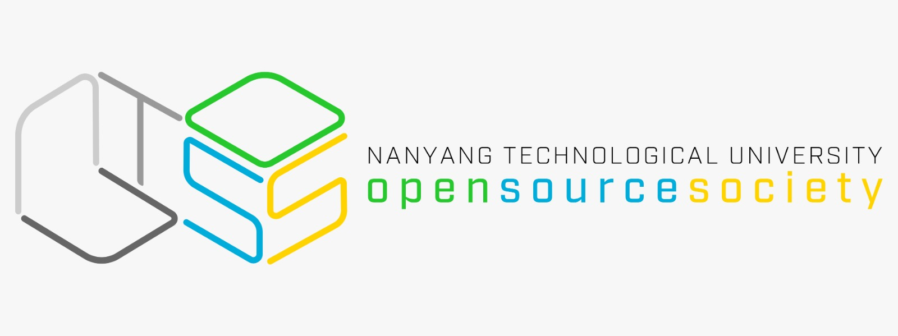

# Meme-It-Workshop

_by [Shiv Alagar](https://github.com/ashivalagar) and [Abhinav NB](https://github.com/ABHINAV112) for the iNTUition hackathon_

This workshop will teach you how to make your own memes! We shall be using computer vision and a ranking algorithm to make our memes. This workshop is based upon a real life hackathon, where memes of the highest quality were produced!



---

## Prerequisites

We will need the following to make ourselves a working meme generator!

### Python 3.x

Our bot will be made using python 3.x, if you don't have python installed. To install python, proceed with the following.

#### Windows

The simplest way to install python for windows is through the [windows installer](https://www.python.org/downloads/). While installing python, **remember to add pip to the PATH!**

#### Mac

##### Brew

The simplest way to install python is if you have [Homebrew](https://brew.sh/) installed, run the following

```bash
$ brew install python3
```

##### Mac installer

In order to install python threw the python for [Mac installer](https://www.python.org/downloads/mac-osx/), go to the website and while installing **remember to add pip to the PATH!**

#### Linux

Run the following to install python for linux

```bash
$ sudo apt-get install python3.6
```

### Telegram

You will need to have [telegram](https://web.telegram.org/#/login), click on the link to make an account if you don't have one!

---

## Setup

### Creating a virtual environment

We will be using a virtual environment to keep our environmnet nice and clean

First, run the following command to download the python virtualenv package

```bash
$ pip install virtualenv
```

Open the folder you wish to keep your local environments in,

```bash
$ mkdir virtual-environments
$ cd virtual-environments
```

Now to make your virtual environment run the following code

```bash
$ virtualenv meme-it
```

To activate the virtual environment, run the following code

<!-- have to check if this will work for all operating systems -->

Windows

```bash
meme-it\Scripts\activate.bat
```

Mac/Linux

```bash
$ source meme-it/bin/activate
```

You will notice that your terminal changes and will look like the following

```bash
(meme-it) $
```

Whenever you open a new terminal and wish to run the code, you will just have to activate our virtual environment

Now copy the [requirements.txt](requirements.txt), into your local environment. Run the following

```bash
$ pip install -r requirements.txt
```

All the dependencies should have been setup

---
