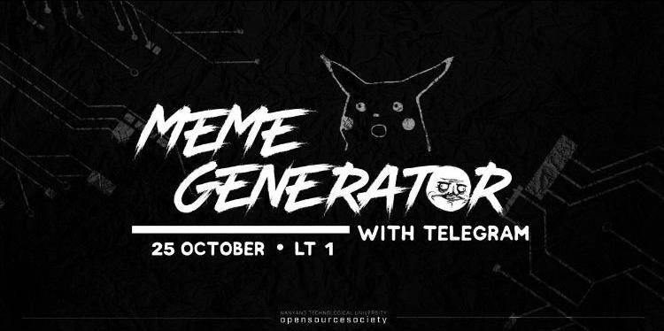
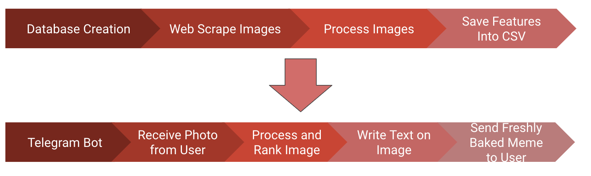

# Meme-It-Workshop

_by [Shiv Alagar](https://github.com/ashivalagar) and [Abhinav NB](https://github.com/ABHINAV112) for the TGIF Hacks_

Based off of a hackathon, this workshop will condense 24 hours of rigorous coding from a team of 4 talented individuals, into 2 hours. Towards the end of this workshop, you shall have made your very own generator of memes! Bask in the glory of meming your friends, and getting the best memes.



---

## Prerequisites

We will need the following to make ourselves a working meme generator!

### Python 3.x

Our bot will be made using python 3.x, if you don't have python installed. To install python, proceed with the following.

#### Windows

The simplest way to install python for windows is through the [windows installer](https://www.python.org/downloads/). While installing python, **remember to add pip to the PATH!**

#### Mac

##### Brew

The simplest way to install python is if you have [Homebrew](https://brew.sh/) installed, run the following

```bash
$ brew install python3
```

##### Mac installer

In order to install python threw the python for [Mac installer](https://www.python.org/downloads/mac-osx/), go to the website and while installing **remember to add pip to the PATH!**

#### Linux

Run the following to install python for linux

```bash
$ sudo apt-get install python3.6
```

### Telegram

You will need to have [telegram](https://web.telegram.org/#/login), click on the link to make an account if you don't have one!

---

## Setup

### Creating a virtual environment

We will be using a virtual environment to keep our environmnet nice and clean

First, run the following command to download the python virtualenv package

```bash
$ pip install virtualenv
```

Open the folder you wish to keep your local environments in,

```bash
$ mkdir virtual-environments
$ cd virtual-environments
```

Now to make your virtual environment run the following code

```bash
$ virtualenv meme-it
```

To activate the virtual environment, run the following code

Windows

```bash
meme-it\Scripts\activate.bat
```

Mac/Linux

```bash
$ source meme-it/bin/activate
```

You will notice that your terminal changes and will look like the following

```bash
(meme-it) $
```

Whenever you open a new terminal and wish to run the code, you will just have to activate our virtual environment

Now copy the [requirements.txt](requirements.txt), into your local environment. Run the following

```bash
$ pip install -r requirements.txt
```

All the dependencies should have been setup

---

## Overall flow of the code

We essentially have 2 sides to our hack, the creation of the database and the telegram bot.



---

## Database Creation

The dirty work, over here we are making our database of memes! We will be processing the data into a usable form, so that we can apply our algorithms to it.

### Web scrape images

### Processing images

### Saving features into the CSV

---

## Telegram Bot

The cleanup, the telegram bot provides a really pretty interface for making your memes. Just take a pic and send it over to the bot.

### Setting up a telegram bot

```python
from telegram.ext import Updater, CommandHandler, MessageHandler, Filters
import wget
updater = Updater(token='<TOKEN>', use_context=True)
dispatcher = updater.dispatcher
```

Use the token obtained from BotFather, this should setup the telegram bot for use.

### Handlers

We use the following code to reply to messages sent by users, we have different handlers based on the type of

```python
def start(update, context):
    context.bot.send_message(chat_id=update.message.chat_id, text="Welcome to the Meme Generator!")

start_handler = CommandHandler('start', start)
dispatcher.add_handler(start_handler)
```

### Recieving photo from the user

```python
def handle_images(update,context):
    file = context.bot.getFile(update.message.photo[-1].file_id)

...
image_handler = MessageHandler(Filters.photo,handle_images)
dispatcher.add_handler(image_handler)

```

Notice, how here we use a message handler with a photo filter.

### Processing the images, and ranking the text

- We first process the image which is sent by the user and get all the tags associated with it.

```python
# downloading the file
downloaded_file = wget.download(file_path,image_path)

# processing the downloaded file
labels = label_detection(downloaded_file)
print(labels)

```

- Next, we shall use a ranking algorithm on our csv. This will determine what the most appropriate text to send is.

```python
# rank the labels to find the text of best fit
picture_text = best_text(labels)
```

Working of the algorithm

```python
def best_text(recieved_image_labels):
    max_matches = -1
    max_index = []
    for i,curr_labels in enumerate(labels):
        # print(text[i],end="\n\n")
        if(text[i]!="" and type(text[i])==str):
            # curr_labels = curr_labels.split(' , ')
            count = 0
            # print(recieved_image_labels,curr_labels)
            for j in recieved_image_labels:
                if j in curr_labels:
                    # print("got here")
                    count+=1
            if(count==max_matches):
                max_index.append(i)
            if(count>max_matches):
                # print("got here also")
                max_matches = count
                max_index = [i]
    out_index = random.choice(max_index)
    return text[out_index]
```

### Writing text onto the image

Now, we can write the text onto the image

```python
# make an image with the caption
make_meme("",picture_text,downloaded_file)
```

### Sending freshly baked memes back to the user

Sending back the captioned meme

```python
# sending the image over telegram bot
context.bot.send_photo(chat_id=update.message.chat_id, photo=open("./Completed/output1.png", 'rb'))
```
